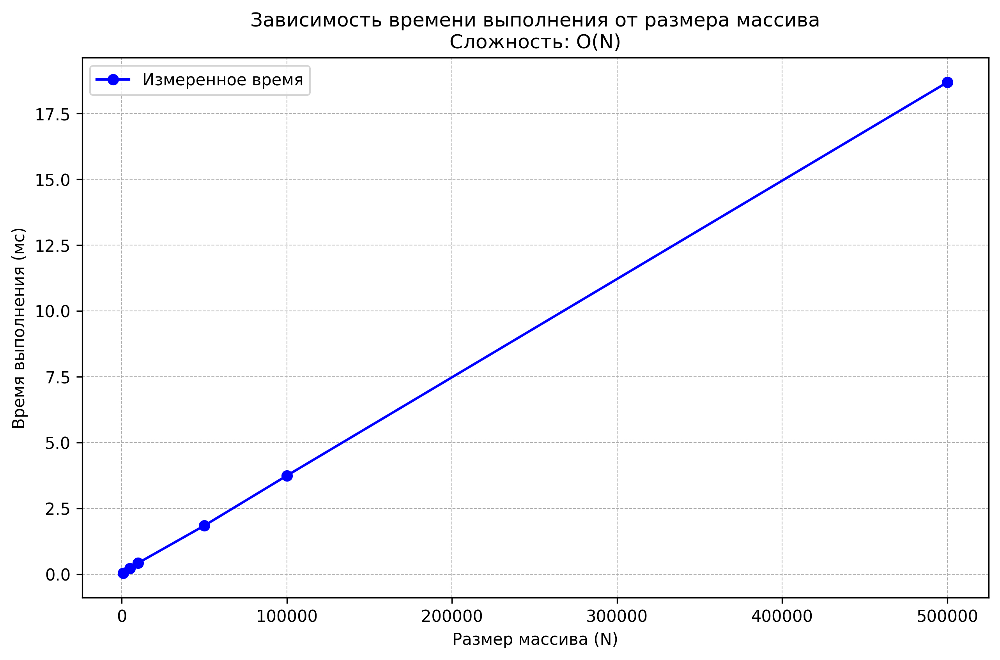

Выполнил: Мадаев Алихан Ахьядович
ПИЖ-б-о-23-1

 Тема 00: Решение алгоритмических задач. Введение в инструменты и критерии
 оценки.
 Цель работы: Настроить рабочее окружение, освоить базовые операции ввода/вывода, написать и
 протестировать первую программу. Научиться оценивать сложность отдельных операций и всей
 программы, проводить эмпирические замеры времени выполнения и визуализировать результаты.
 Теория (кратко):
 Алгоритм — это последовательность шагов для решения определенной задачи.
 Структуры данных — способы организации данных для эффективной работы с ними.
 Оценка решения: Правильность работы алгоритма и его эффективность (скорость работы и
 потребление памяти) — ключевые критерии качества.
 Ввод и вывод данных: Стандартные потоки ввода/вывода (stdin, stdout). Работа с консолью.
 Сложность алгоритма: Количество операций, выполняемых алгоритмом, как функция от объема
 входных данных (N). Описывается с помощью О-нотации (O-большое).

 Замеры результатов:
   Размер N   Время (мс)   Время/N (мкс)
      1000       0.0393          0.0393
      5000       0.2167          0.0433
     10000       0.4265          0.0427
     50000       1.8437          0.0369
    100000       3.7424          0.0374
    500000      18.6848          0.0374

