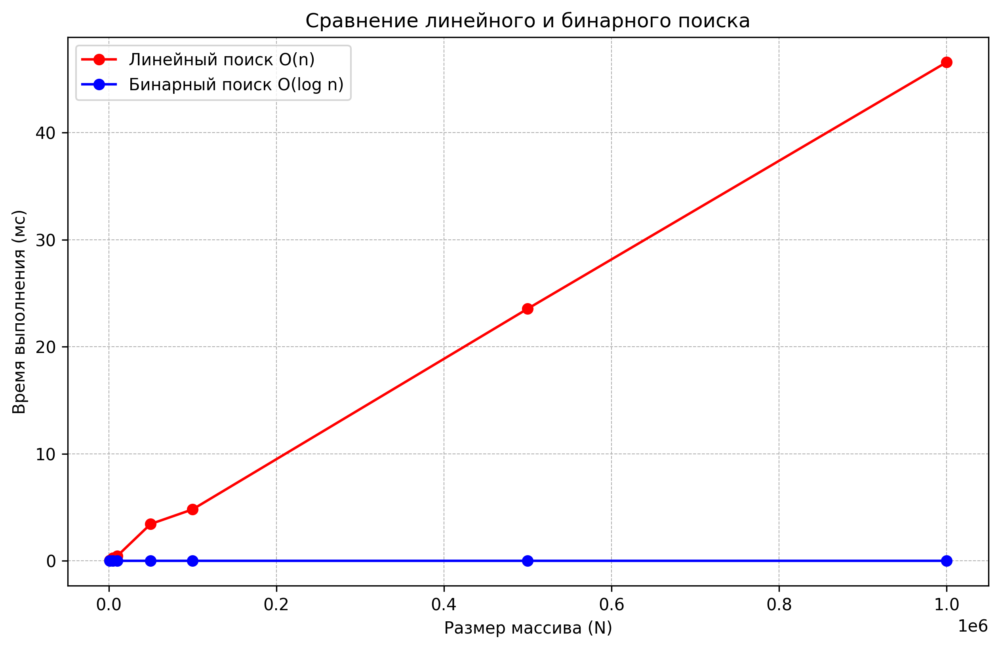
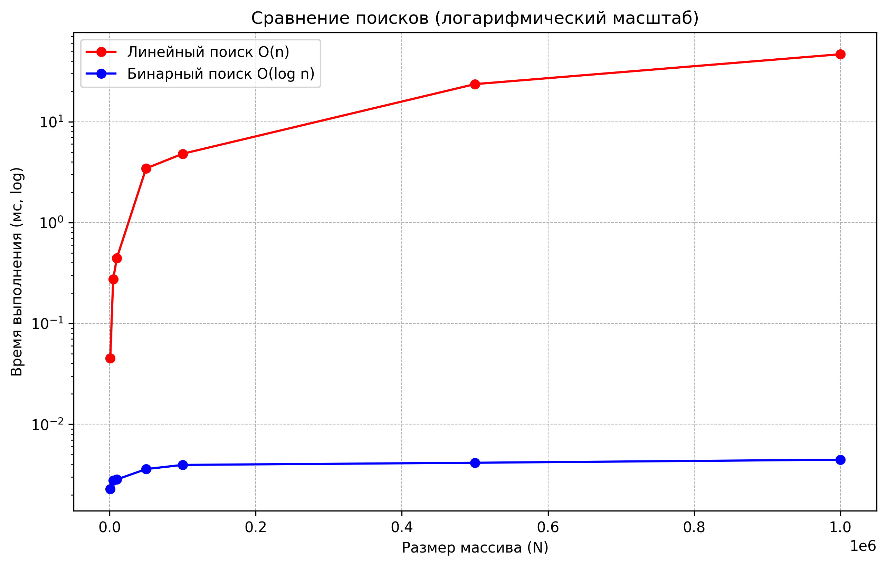

 Тема 01: Введение в алгоритмы. Сложность. Поиск.
 Цель работы: Освоить понятие вычислительной сложности алгоритма. Получить практические навыки
 реализации и анализа линейного и бинарного поиска. Научиться экспериментально подтверждать
 теоретические оценки сложности O(n) и O(log n).
 Теория (кратко):
 Сложность алгоритма: Характеризует количество ресурсов (времени и памяти), необходимых
 алгоритму для обработки входных данных объема n.
 Асимптотический анализ: Анализ поведения алгоритма при стремлении n к бесконечности.
 Позволяет абстрагироваться от констант и аппаратных особенностей.
 O-нотация («О-большое»): Верхняя асимптотическая оценка роста функции. Определяет
 наихудший сценарий работы алгоритма.
 Линейный поиск (Linear Search): Последовательный перебор всех элементов массива.
 Сложность: O(n).
 Бинарный поиск (Binary Search): Поиск в отсортированном массиве путем многократного
 деления интервала поиска пополам. Сложность: O(log n). Требует предварительной сортировки
 (O(n log n)).
 Практика (подробно):
 Задание:
 1. Реализовать функцию линейного поиска элемента в массиве.
 2. Реализовать функцию бинарного поиска элемента в отсортированном массиве.
 3. Провести теоретический анализ сложности обоих алгоритмов.
 4. Экспериментально сравнить время выполнения алгоритмов на массивах разного размера.
 5. Визуализировать результаты, подтвердив асимптотику O(n) и O(log n).

Было проведено 5 замеров и был записан усредненный результат
 Замер рузультатов
  Размер N   Линейный (мс)   Бинарный (мс)
      1000        0.045120        0.002280
      5000        0.274760        0.002780
     10000        0.444780        0.002840
     50000        3.441400        0.003600
    100000        4.804400        0.003960
    500000       23.556600        0.004160
   1000000       46.588160        0.004460

Сравнение скоростей ввиде графиков

